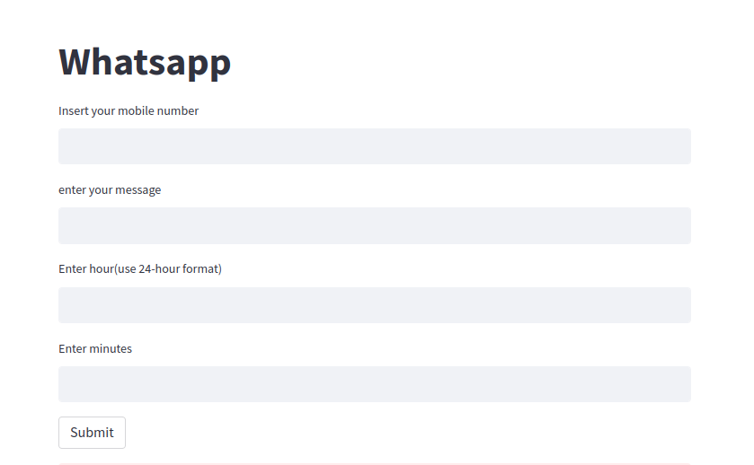

# whatsapp_python_web_app

# Project Requirements:

Phase:1
- Create a streamlit web application which takes number,msg ,hour and minute as an input and a send button which automatically send your message to your contact number using web.whatsapp 
- https://github.com/mhgn/whatsapp_python_webapp/releases/tag/phase-1

Phase:2
- Add multiple numbers 

# How to run this project:

## Clone this repository on your local system
- git clone https://github.com/mhgn/whatsapp_python_webapp.git

## Create a virtual environment
- python3 -m venv venv

## Activate your virtual environment
- source venv/bin/activate (For Linux Users)

## Install all the requirements packages
- pip install -r requirements.txt

## Run the App
- streamlit run streamlit_app.py